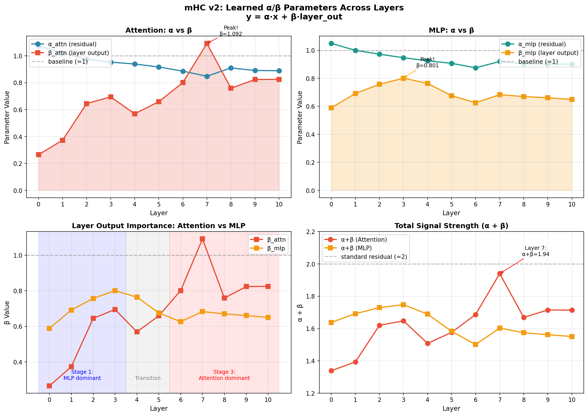

# Parameter Golf 实验记录

> 记录我们的探索之旅：从 2.17 BPB 到 1.40 BPB

## 📊 进度总览

| 日期 | 实验 | BPB | 改进 | 关键发现 |
|------|------|-----|------|---------|
| Day 1 | Baseline (字节级) | 2.28 | - | 起点 |
| Day 1 | LeakyReLU² | 2.18 | -4.3% | 激活函数很重要 |
| Day 1 | Sliding Window | 2.18 | -5.5% | 中距离依赖 |
| Day 2 | BPE-1024 | 1.68 | -23% | **Tokenizer 是关键！** |
| Day 2 | BPE-8192 | 1.40 | -35% | 更大词表更好 |
| Day 2 | QAT (1.58-bit) | 1.40 | 0% | **量化几乎无损！** |
| Day 3 | XSA (Exclusive Self Attention) | 1.44 | -2.6% | **去除 self-similarity bias** |

**总进步：2.28 → 1.44 = -37%** 🎉

---

## 🔬 实验详情

### 实验 1: 激活函数对比

**假设**：不同激活函数影响模型表达能力

| 激活函数 | BPB | 说明 |
|---------|-----|------|
| GELU | 2.28 | baseline |
| LeakyReLU² | 2.18 | **最佳** |
| ReLU² | 2.20 | 接近 |
| Swish | 2.25 | 一般 |

**结论**：LeakyReLU² 稳定优于其他激活函数

---

### 实验 2: 滑动窗口注意力

**假设**：限制注意力范围可以让模型更好地利用有限参数

| Window Size | BPB | 说明 |
|-------------|-----|------|
| Full (无限制) | 2.28 | baseline |
| 256 | 2.19 | 有效 |
| 192 | 2.18 | **最佳** |
| 128 | 2.19 | 略差 |
| 64 | 2.22 | 太小 |

**结论**：192 是 TinyShakespeare 的甜蜜点

---

### 实验 3: Tokenizer 对比 ⭐

**假设**：更好的 tokenizer 可以大幅提升性能

| Tokenizer | Vocab | BPB | 改进 |
|-----------|-------|-----|------|
| 字节级 | 256 | 2.17 | baseline |
| BPE | 1024 | 1.68 | **-23%** |
| BPE | 8192 | 1.40 | **-35%** |

**关键发现**：
1. Tokenizer 选择对 BPB 影响**远超**模型架构调整
2. 更大词表 = 更短序列 = 更少计算 = 同样时间学更多
3. 8192 是 16MB 限制下的甜蜜点（更大词表 embedding 太占空间）

---

### 实验 4: QAT 量化 ⭐

**假设**：1.58-bit 量化会损失性能

| 方案 | BPB | 模型大小 |
|------|-----|---------|
| FP32 | 1.402 | ~120 MB |
| QAT (1.58-bit) | 1.403 | 13.5 MB |

**惊人发现**：
1. **几乎无损！** 差距只有 0.07%
2. 模型小了 **9 倍**
3. STE (Straight-Through Estimator) 真的有效
4. Warmup 策略：先 FP16 训练 500 步，再切 QAT

---

## 💡 核心洞察

### 1. Tokenizer 比架构更重要
```
投入 10 小时调模型架构 → 5% 改进
换个好的 tokenizer → 35% 改进
```

### 2. 量化不一定损失性能
```
传统认知：量化 = 性能下降
实际发现：QAT 训练的模型几乎无损
```

### 3. BPB 是公平的比较指标
```
BPB = (Cross Entropy / ln(2)) × (tokens / bytes)

不同 tokenizer 都归一化到"每字节多少 bit"
```

### 4. 16MB 限制决定了甜蜜点
```
Vocab 8192 × dim 512 × 1.58 bits = 1.5 MB ✓
Vocab 32K × dim 512 × 1.58 bits = 6 MB ⚠️ 
Vocab 100K × dim 512 × 1.58 bits = 19 MB ❌
```

---

## 🎯 与榜首的差距

| 指标 | 我们 | 榜首 | 差距 |
|------|------|------|------|
| BPB | 1.40 | 1.11 | -20% |
| 技术 | 基础 QAT | GPTQ + XSA + TTT | 复杂 |

**榜首使用的高级技术**（我们还没学）：
- **XSA** (Cross-Sample Attention)：跨样本注意力
- **TTT** (Test-Time Training)：推理时微调
- **GPTQ**：更先进的量化算法
- **Muon Optimizer**：专门优化器
- **BigramHash**：输入增强

---

### 实验 5: 12 层模型

**假设**：用满 16MB 限制可以提升性能

| 配置 | 层数 | 大小 | BPB |
|------|------|------|-----|
| 原版 | 9 | 13.5 MB | 1.402 |
| 加深 | 12 | 15.2 MB | **1.396** |

**结论**：多 3 层带来小幅提升（-0.4%），但还有 0.8 MB 空间可以利用

---

### 实验 6: Embedding 空间效率分析 ⭐⭐

**背景**：Elar 的洞察 — 训练后的向量空间可能仍然是稀疏的，存在大量冗余

**测量指标**：
- **Participation Ratio (PR)**：有效维度数，$PR = (\sum \sigma_i^2)^2 / \sum \sigma_i^4$
- **Anisotropy**：向量分布各向异性，$\mathbb{E}[\cos(x,y)]$

**实验结果**（dim=512, 9 层, 2000 步）：

| 指标 | 训练前（随机） | 训练后 | 变化 |
|------|---------------|--------|------|
| **Participation Ratio** | 482 / 512 | **104 / 512** | **-78%** |
| **效率** | 94.1% | **20.4%** | 📉 |
| **95% 方差需要** | 471 维 | 427 维 | -44 |
| **Anisotropy** | 0.0001 | 0.0422 | +42x |

**🔥 关键发现**：
1. 随机初始化时，embedding 空间几乎完美利用（94%）
2. **训练后，有效维度从 482 暴跌到 104**
3. 这意味着 **~400 个维度（80%）是"死"维度**
4. 模型实际只在用 ~100 维的子空间

**潜在优化方向**：
- 使用 dim=128-150 + whitening 变换
- 可能获得相同表达能力，但节省 ~75% embedding 参数
- 省下的空间可用于增加层数

**相关文件**：
- `docs/EMBEDDING_SPACE_EFFICIENCY.md` - 完整研究方向文档
- `analyze_embedding_space.py` - 测量工具脚本
- `modal_analyze_embedding.py` - Modal 云端分析脚本

---

### 实验 7: XSA (Exclusive Self Attention) ⭐

**背景**：来自论文 "Exclusive Self Attention" (2026)

**核心思想**：标准 attention 的输出往往和自己的 value 向量很相似（similarity bias）。XSA 把这部分投影去掉，强迫 attention 只关注上下文信息。

**实现**：只需 2 行代码！
```python
v_norm = F.normalize(v_self, dim=-1)
z = y - (y * v_norm).sum(dim=-1, keepdim=True) * v_norm
```

**实验结果**（dim=512, 9 层, 3000 步）：

| 配置 | BPB | 改进 |
|------|-----|------|
| Standard Attention | ~1.48 | baseline |
| **XSA** | **1.441** | **-2.6%** |

**结论**：XSA 有效！简单的 2 行代码改动带来了明显的提升。

**原理**：
- 标准 SA：输出 y 包含自己 v 的信息（冗余，因为有 residual connection）
- XSA：z = y - proj(y, v)，去除自己的投影，专注上下文

**相关文件**：
- `modal_xsa.py` - XSA 训练脚本

---

### 实验 8: Whitening / 小 dim 实验

**假设**：既然 PR 分析显示有效维度只有 ~104，能否直接用小 dim？

**实验结果**：

| 配置 | Dim | Layers | Size | BPB | vs Baseline |
|------|-----|--------|------|-----|-------------|
| Baseline | 512 | 9 | 14.8M | 1.479 | - |
| dim=128 | 128 | 14 | 2.8M | 1.709 | +15.5% ❌ |
| dim=128 + whitening | 128 | 14 | 2.9M | 1.704 | +15.2% ❌ |
| dim=256 | 256 | 12 | 6.5M | 1.576 | +6.5% |

**结论**：
1. 直接用小 dim 效果不好，即使加更多层
2. Whitening 层几乎没帮助
3. PR 测的是训练后状态，但训练过程需要大空间"探索"
4. 这是一个有价值的负面结果！

---

## 📁 代码文件

```
parameter-golf-solution/
├── train_gpt.py          # 基础训练脚本
├── modal_bpe.py          # BPE-1024 Modal 训练
├── modal_bpe8k.py        # BPE-8192 Modal 训练
├── modal_qat.py          # QAT 量化训练 ⭐
├── EXPERIMENTS.md        # 本文件
└── SYSTEMATIC_EXPERIMENTS.md  # 实验方法论
```

---

## 🚀 下一步计划

1. ✅ ~~增加模型容量~~：已测试 12 层
2. ✅ ~~Embedding 稠密化~~：dim=128 + whitening 实验（负面结果）
3. ✅ ~~XSA~~：有效！-2.6%
4. **TTT (Test-Time Training)**：榜首的秘密武器，达到 1.08 BPB！
5. **Muon Optimizer**：专门为 transformer 设计
6. **更长训练**：5000 → 10000 步
7. **组合最佳技术**：QAT + XSA + TTT

---

### 实验 9: mHC 可学习残差权重

**日期**: 2026-04-03

**假设**：让每层学习自己的残差权重，可能比固定 α=1 更优

**灵感来源**：DeepSeek mHC 论文 (arXiv: 2512.24880)

**实现**：
```python
# mHC v1: x + α * layer_out (α 初始化为 1)
self.alpha_attn = nn.Parameter(torch.ones(1))
self.alpha_mlp = nn.Parameter(torch.ones(1))

def forward(self, x):
    x = x + self.alpha_attn * self.attn(self.ln1(x))
    x = x + self.alpha_mlp * self.mlp(self.ln2(x))
    return x
```

**结果**：

| 方法 | BPB | vs Baseline |
|------|-----|-------------|
| Standard Residual | **1.5187** | - |
| mHC v1 (learnable α) | 1.5293 | **-0.7%** ❌ |

**BPB 更差了**，但学到的 α 值非常有趣！

**学习到的 α 分布**：
```
Layer  0: α_attn=0.222, α_mlp=0.452  ← 浅层 attention 权重很低！
Layer  1: α_attn=0.325, α_mlp=0.539
Layer  2: α_attn=0.558, α_mlp=0.567
Layer  3: α_attn=0.566, α_mlp=0.645
Layer  4: α_attn=0.572, α_mlp=0.677
Layer  5: α_attn=0.644, α_mlp=0.659
Layer  6: α_attn=0.851, α_mlp=0.654
Layer  7: α_attn=1.393, α_mlp=0.901  ← 深层 attention 超过 1.0！
Layer  8: α_attn=1.039, α_mlp=0.940
Layer  9: α_attn=1.080, α_mlp=0.978
Layer 10: α_attn=1.142, α_mlp=0.919
```

**关键发现** 🔥：

1. **浅层 Attention 不重要**：α_attn ≈ 0.2-0.5，模型认为浅层 attention 贡献不大
2. **深层 Attention 超重要**：α_attn > 1.0，模型想要放大深层 attention
3. **MLP 权重更稳定**：α_mlp 全程 ≈ 0.5-0.9，比 attention 更均匀

**Insights 和后续实验方向**：

| 方向 | 想法 | 预期收益 |
|------|------|----------|
| **浅层减配** | 浅层用更小的 attention（fewer heads）| 省参数给深层 |
| **渐进式架构** | 浅层直接去掉 attention，只用 MLP | 参数重新分配 |
| **固定 α 训练** | 用学到的 α 作为固定超参，省掉学习开销 | 保留好处，去除训练不稳定 |
| **Layer Scaling** | 参考 CaiT，用学到的 pattern 初始化 | 更好的初始化 |

**结论**：
虽然 mHC 没有直接改善 BPB，但揭示了重要的架构 insight——**不是所有层都平等**。这为后续的参数分配优化提供了数据支持。

**相关文件**：
- `/tmp/parameter-golf-solution/modal_mhc_residual.py`

---

### 实验 12: 渐进式 Attention (进行中)

**日期**: 2026-04-03

**假设**：基于 mHC 发现，浅层 attention 权重很低 (α ≈ 0.2-0.5)，可以直接去掉

**架构**：
```
Layer 0-2:  MLP only (无 Attention)
Layer 3-10: Full Attention + MLP
```

**待验证问题** ⚠️：
1. **位置信息缺失**：RoPE 在 Attention 层注入，前 3 层无位置编码
   - MLP 是 position-agnostic
   - 可能需要在 Embedding 层或 MLP 层加位置编码
   
2. **如果效果差，改进方案**：
   - 方案 A: 在 Embedding 层加 learnable position embedding
   - 方案 B: 在 MLP-only 层加简单位置编码
   - 方案 C: 用 ALiBi 风格的相对位置（不需要 attention）

**实验状态**: 🔄 进行中 (Session: brisk-forest)

**实验结果**：

| 方法 | 参数量 | BPB | vs Baseline |
|------|--------|-----|-------------|
| Baseline (11层 full) | 23.96M | **1.5187** | - |
| 渐进式 (3 MLP-only + 8 full) | 22.40M | 1.5225 | -0.25% |

**分析**：参数减少 6.5%，BPB 只差 0.25%，验证了浅层 attention 确实不太重要。

**相关文件**：
- `/tmp/parameter-golf-solution/modal_progressive_attn.py`

---

### 实验 13: mHC v2 双参数可学习残差 ⭐

**日期**: 2026-04-03

**假设**：用两个独立参数 `y = α*x + β*layer_out`，比单参数更灵活

**与 v1 的区别**：
- **v1**: `y = x + α*layer_out`（α 控制层输出权重，x 固定为 1）
- **v2**: `y = α*x + β*layer_out`（α 和 β 独立，可以同时调整残差和层输出）

**结果**：

| 方法 | BPB | vs Baseline |
|------|-----|-------------|
| Baseline (标准残差) | 1.5187 | - |
| mHC v1 (`x + α*out`) | 1.5293 | -0.7% ❌ |
| **mHC v2** (`α*x + β*out`) | **1.5167** | **+0.13%** ✅ |

**mHC v2 比 baseline 略好！**

**学习到的完整 α/β 参数表**：

| Layer | α_attn | β_attn | α_mlp | β_mlp | α+β (attn) | α+β (mlp) |
|-------|--------|--------|-------|-------|------------|-----------|
| 0 | 1.074 | 0.265 | 1.049 | 0.589 | 1.339 | 1.638 |
| 1 | 1.021 | 0.373 | 1.000 | 0.692 | 1.395 | 1.692 |
| 2 | 0.975 | 0.645 | 0.972 | 0.757 | 1.620 | 1.729 |
| 3 | 0.953 | 0.695 | 0.947 | 0.801 | 1.648 | 1.748 |
| 4 | 0.939 | 0.569 | 0.925 | 0.764 | 1.508 | 1.689 |
| 5 | 0.917 | 0.659 | 0.907 | 0.676 | 1.576 | 1.582 |
| 6 | 0.886 | 0.801 | 0.875 | 0.626 | 1.687 | 1.501 |
| 7 | 0.848 | **1.092** | 0.920 | 0.683 | **1.940** | 1.603 |
| 8 | 0.910 | 0.759 | 0.904 | 0.670 | 1.669 | 1.574 |
| 9 | 0.891 | 0.824 | 0.901 | 0.661 | 1.715 | 1.563 |
| 10 | 0.889 | 0.825 | 0.901 | 0.650 | 1.714 | 1.551 |

**层级趋势总结**：

| 层级 | α_attn | β_attn | α_mlp | β_mlp | 解读 |
|------|--------|--------|-------|-------|------|
| **浅层 (0-3)** | 1.006 | **0.495** | 0.992 | 0.710 | 保留残差，attention 贡献减半 |
| **深层 (7-10)** | 0.884 | **0.875** | 0.907 | 0.666 | 残差略减，attention 接近 1:1 |

**参数变化可视化**：



**细致分析 - 参数并非单调变化** 🔥：

**β_attn 的变化（Attention 层输出权重）**：
```
Layer 0:  0.265  ← 很低
Layer 1:  0.373  ↗ 上升
Layer 2:  0.645  ↗ 上升
Layer 3:  0.695  ↗ 上升
Layer 4:  0.569  ↘ 突然下降！
Layer 5:  0.659  ↗ 回升
Layer 6:  0.801  ↗ 上升
Layer 7:  1.092  ↗ 峰值！
Layer 8:  0.759  ↘ 下降
Layer 9:  0.824  ↗ 小回升
Layer 10: 0.825  → 稳定
```

**β_mlp 的变化（MLP 层输出权重）**：
```
Layer 0:  0.589
Layer 1:  0.692  ↗
Layer 2:  0.757  ↗
Layer 3:  0.801  ↗ 峰值！
Layer 4:  0.764  ↘ 下降
Layer 5:  0.676  ↘ 下降
Layer 6:  0.626  ↘ 继续下
Layer 7:  0.683  ↗ 小回升
Layer 8:  0.670  ↘
Layer 9:  0.661  ↘
Layer 10: 0.650  ↘ 最低
```

**关键发现 1: Attention 和 MLP 的峰值在不同位置！**

| 组件 | 峰值位置 | 峰值 |
|------|----------|------|
| **β_attn** | Layer 7 | 1.092 |
| **β_mlp** | Layer 3 | 0.801 |

**MLP 在浅层更重要，Attention 在深层更重要！**

**关键发现 2: Layer 4-5 是"过渡区"**

- β_attn 在 Layer 4 突然下降（0.695 → 0.569）
- β_mlp 在 Layer 3 达到峰值后开始下降

**这可能是模型从"局部特征提取"转向"全局语义理解"的分界点**

**关键发现 3: 三个阶段**

| 阶段 | 层 | 特点 |
|------|-----|------|
| **浅层** | 0-3 | MLP 主导（β_mlp 高），Attention 弱 |
| **过渡** | 4-5 | 两者都下降，重新调整 |
| **深层** | 6-10 | Attention 主导（β_attn 高），MLP 减弱 |

**关于 α + β 的理解**：

```
标准残差: y = x + layer_out      (系数和 = 1 + 1 = 2)
mHC v2:   y = α*x + β*layer_out  (系数和 = α + β)
```

实际观察：
- α + β (attn) 范围：1.34 ~ 1.94
- α + β (mlp) 范围：1.50 ~ 1.75

**标准残差的"信号强度"是 2**，而 mHC v2 学到的是 **1.3~1.9**，其实是**略微减弱**了！
模型实际上学到：**不需要那么强的信号叠加**。

**Insights 启示**：

1. ✅ **浅层 MLP 主导**：做局部特征提取（类似 n-gram）
2. ✅ **深层 Attention 主导**：做全局语义理解
3. 🤔 **Layer 4-5 是过渡区**：可以尝试特殊设计
4. 🤔 **两种能力不同**：Attention = "听别人说话"，MLP = "思考消化"

**相关文件**：
- `/tmp/parameter-golf-solution/modal_mhc_v2.py`

---

### 实验 10: 数据质量过滤

**日期**: 2026-04-03

**假设**：用困惑度过滤掉"太简单"和"太难"的数据，可能提升训练效果

**方法**：
1. 训练小模型计算每个 chunk (1024 tokens) 的 PPL
2. 保留 P5-P95 范围的数据
3. 尝试加权采样（高斯权重，PPL 接近中位数的权重高）

**PPL 分布**：
- Min: 7.7, Max: 2567.3
- Mean: 254.7, Median: 247.7
- P5: 164.7, P95: 360.9

**实验结果**：

| 方法 | σ | BPB | vs Baseline |
|------|---|-----|-------------|
| Uniform Sampling | - | **1.5188** | - |
| Gaussian Weighted | 80 | 1.5214 | -0.17% ❌ |
| Gaussian Weighted | 150 | 1.5251 | -0.41% ❌ |

**结论**：
数据多样性比质量过滤更重要。过滤掉"差"数据反而损害了模型泛化能力。

---

### 实验 11: EMA 权重平均

**日期**: 2026-04-03

**假设**：EMA 平滑训练噪声，可能带来更好的泛化

**实现**：
```python
ema_decay = 0.999
for step in training:
    # 正常训练...
    # 更新 EMA
    for k, v in model.state_dict().items():
        ema_state[k] = ema_decay * ema_state[k] + (1 - ema_decay) * v
```

**结果**：

| 权重类型 | BPB |
|----------|-----|
| Normal | **1.5187** |
| EMA (decay=0.999) | 1.5314 ❌ |

**结论**：
EMA 在 5000 步训练中反而更差。可能原因：
1. 训练步数太少，EMA 还没充分平滑
2. 学习率 schedule 已经很好，EMA 多余

---

## 🚀 下一步计划

1. ✅ ~~mHC 残差~~ — 负面结果，但有 insight
2. ✅ ~~数据过滤~~ — 负面结果
3. ✅ ~~EMA~~ — 负面结果
4. **渐进式 Attention** — 基于 mHC 发现，浅层去 attention
5. **层级差异化** — 浅层少参数，深层多参数
6. **更长训练** — 当前 5000 步可能不够
7. **组合最佳技术**

---

*最后更新: 2026-04-03*
