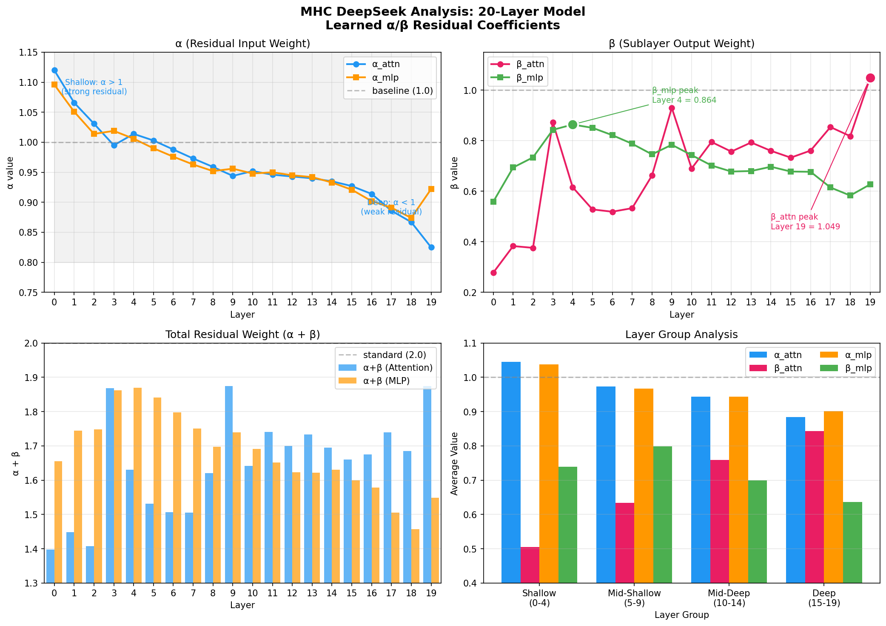
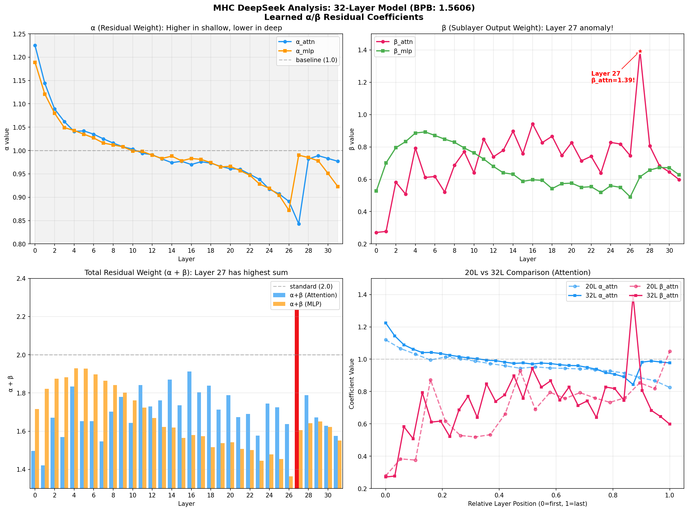

# mHC 可学习残差实验分析

> 基于 DeepSeek mHC 论文 (arXiv: 2512.24880) 的探索
> 
> 📅 2026-04-03

---

## 研究动机

标准 Transformer 的残差连接是固定的 `y = x + sublayer(x)`，每一层对残差和子层输出的权重都是 1:1。但不同深度的层真的需要相同的权重吗？

DeepSeek 的 mHC (Mixture of Hidden Coefficients) 提出让每层学习自己的残差系数。我们想验证：
1. 这个方法在小模型上是否有效？
2. 不同层会学到什么样的系数分布？
3. 这些分布能告诉我们什么架构设计的启示？

---

## 实验一：单参数 mHC (v1)

### 做了什么

把残差连接改成 `y = x + α·sublayer(x)`，让 α 可学习（初始化为 1）。

### 结果

BPB 从 1.5187 变成 1.5293，**反而变差了 0.7%**。

但学到的 α 值很有意思：浅层的 α_attn 只有 0.2-0.5，深层却超过 1.0。这说明**模型认为浅层 attention 的贡献应该被压低，深层应该被放大**。

### 推测

单参数的问题在于：它只能调整子层输出的权重，无法同时调整残差输入的权重。这限制了模型的自由度。

---

## 实验二：双参数 mHC (v2) ⭐

### 做了什么

改成 `y = α·x + β·sublayer(x)`，α 和 β 独立可学习。每层有 4 个参数：α_attn, β_attn, α_mlp, β_mlp。

### 结果

BPB 达到 **1.5167**，比 baseline **略好 0.13%**。虽然提升不大，但学到的参数分布揭示了重要规律。

### 发现 1：Attention 和 MLP 的重要性在不同深度

观察 11 层模型的 β 值（子层输出权重）：

- **β_mlp 峰值在 Layer 3**（浅层）
- **β_attn 峰值在 Layer 7**（深层），而且超过了 1.0

这意味着：**浅层主要靠 MLP 做特征提取，深层主要靠 Attention 做上下文整合**。

### 发现 2：三阶段模式

参数变化不是单调的，而是呈现三个阶段：

1. **浅层 (0-3)**：MLP 主导，β_mlp 高；Attention 弱，β_attn 低
2. **过渡 (4-5)**：两者都下降，像是在"重新调整"
3. **深层 (6-10)**：Attention 主导，β_attn 高；MLP 减弱

Layer 4 的 β_attn 突然从 0.695 跌到 0.569，这个"过渡区"可能是模型从局部特征提取转向全局语义理解的分界点。

### 发现 3：标准残差可能"太强"了

标准残差的系数和是 1+1=2，但 mHC v2 学到的 α+β 大多在 1.3-1.9 之间。模型似乎在说：**不需要那么强的信号叠加**。

---

## 实验三：更深的模型

### 做了什么

在 20 层和 32 层模型上重复实验，观察规律是否一致。

### 20 层结果

BPB: 1.4978

β_attn 峰值出现在 Layer 19（最后一层），β_mlp 峰值在 Layer 4（20% 深度）。规律与 11 层一致。

### 32 层结果 ⭐⭐⭐

BPB: 1.4651

出现了一个**异常现象**：Layer 27 的 β_attn 达到 **1.39**，远超其他层（通常 0.8-1.1）。而且 α+β 总和达到 2.24，是唯一超过 2.0 的层。

关键是：**Layer 27 不是最后一层**，而是倒数第 5 层（84% 深度）。

---

## 💡 重大发现：~90% 深度异常

汇总三个模型的异常层位置：

| 模型 | 异常层 | 相对位置 |
|------|--------|----------|
| 11L | Layer 7 | 64% |
| 20L | Layer 19 | 95% |
| 32L | Layer 27 | 84% |

**所有模型在 ~85-95% 深度都出现 β_attn 高峰。这不是最后一层，而是"预输出整合层"。**

### 为什么会这样？

我们的推测：

1. **预输出整合层**：模型需要在输出前专门整合上下文信息，类似人类"总结归纳"的认知阶段

2. **信息瓶颈**：从高维表征压缩到词表预测时，需要更强的 attention 来选择最相关的信息

3. **Weight Tying 影响**：输出层与 embedding 共享权重，反向传播的梯度可能在附近层积累

4. **LayerNorm 累积效应**：深层的归一化可能需要更大的输入来补偿

---

## 验证实验：渐进式 Attention

### 做了什么

既然浅层 attention 不重要，干脆去掉。前 3 层只用 MLP，后 8 层正常。

### 结果

参数减少 6.5%（23.96M → 22.40M），BPB 只差 0.25%（1.5187 → 1.5225）。

**验证了浅层 attention 确实可以被削弱或去除。**

---

## 架构启示

基于这些发现，有几个潜在的优化方向：

1. **异构深度架构**：浅层用小 attention 或去掉，省下的参数给深层（特别是 ~85% 深度的"整合层"）

2. **固定 α/β**：直接用学到的值作为超参数，省掉学习开销

3. **动态残差**：让 α/β 根据输入动态计算，类似 SE-Net

---

## 后续计划

- [ ] 用不同 seed 验证 32L Layer 27 异常的复现性
- [ ] 48L/64L 实验，看异常层是否出现在 ~85% 深度
- [ ] 实现异构深度架构

---

## 附录 A：11 层模型完整参数

| Layer | α_attn | β_attn | α_mlp | β_mlp | α+β (attn) | α+β (mlp) |
|-------|--------|--------|-------|-------|------------|-----------|
| 0 | 1.074 | 0.265 | 1.049 | 0.589 | 1.339 | 1.638 |
| 1 | 1.021 | 0.373 | 1.000 | 0.692 | 1.395 | 1.692 |
| 2 | 0.975 | 0.645 | 0.972 | 0.757 | 1.620 | 1.729 |
| 3 | 0.953 | 0.695 | 0.947 | 0.801 | 1.648 | 1.748 |
| 4 | 0.939 | 0.569 | 0.925 | 0.764 | 1.508 | 1.689 |
| 5 | 0.917 | 0.659 | 0.907 | 0.676 | 1.576 | 1.582 |
| 6 | 0.886 | 0.801 | 0.875 | 0.626 | 1.687 | 1.501 |
| 7 | 0.848 | 1.092 | 0.920 | 0.683 | 1.940 | 1.603 |
| 8 | 0.910 | 0.759 | 0.904 | 0.670 | 1.669 | 1.574 |
| 9 | 0.891 | 0.824 | 0.901 | 0.661 | 1.715 | 1.563 |
| 10 | 0.889 | 0.825 | 0.901 | 0.650 | 1.714 | 1.551 |

## 附录 B：20 层模型完整参数

| Layer | α_attn | β_attn | α_mlp | β_mlp | α+β(attn) | α+β(mlp) |
|-------|--------|--------|-------|-------|-----------|----------|
| 0 | 1.120 | 0.278 | 1.096 | 0.559 | 1.398 | 1.655 |
| 1 | 1.066 | 0.383 | 1.051 | 0.694 | 1.450 | 1.746 |
| 2 | 1.031 | 0.376 | 1.014 | 0.734 | 1.407 | 1.748 |
| 3 | 0.995 | 0.873 | 1.019 | 0.843 | 1.869 | 1.862 |
| 4 | 1.014 | 0.616 | 1.006 | 0.864 | 1.630 | 1.869 |
| 5 | 1.003 | 0.528 | 0.990 | 0.851 | 1.531 | 1.841 |
| 6 | 0.988 | 0.519 | 0.976 | 0.822 | 1.507 | 1.797 |
| 7 | 0.973 | 0.533 | 0.963 | 0.788 | 1.506 | 1.751 |
| 8 | 0.959 | 0.662 | 0.952 | 0.746 | 1.621 | 1.698 |
| 9 | 0.944 | 0.930 | 0.956 | 0.784 | 1.873 | 1.740 |
| 10 | 0.952 | 0.690 | 0.948 | 0.743 | 1.643 | 1.691 |
| 11 | 0.946 | 0.795 | 0.950 | 0.702 | 1.741 | 1.652 |
| 12 | 0.943 | 0.757 | 0.945 | 0.678 | 1.700 | 1.623 |
| 13 | 0.940 | 0.793 | 0.942 | 0.680 | 1.734 | 1.622 |
| 14 | 0.935 | 0.760 | 0.933 | 0.697 | 1.694 | 1.630 |
| 15 | 0.927 | 0.733 | 0.921 | 0.678 | 1.660 | 1.598 |
| 16 | 0.914 | 0.761 | 0.902 | 0.677 | 1.675 | 1.579 |
| 17 | 0.886 | 0.854 | 0.891 | 0.615 | 1.740 | 1.506 |
| 18 | 0.867 | 0.818 | 0.874 | 0.583 | 1.685 | 1.457 |
| 19 | 0.825 | 1.049 | 0.922 | 0.627 | 1.874 | 1.549 |

## 附录 C：32 层模型关键参数

| Layer | α_attn | β_attn | α_mlp | β_mlp | α+β(attn) | 备注 |
|-------|--------|--------|-------|-------|-----------|------|
| 0 | 1.224 | 0.180 | 1.162 | 0.475 | 1.404 | |
| 6 | 1.020 | 0.416 | 0.971 | 0.804 | 1.436 | β_mlp 峰值 |
| 15 | 0.915 | 0.840 | 0.884 | 0.649 | 1.755 | |
| 25 | 0.865 | 0.867 | 0.872 | 0.634 | 1.732 | |
| 26 | 0.856 | 0.970 | 0.868 | 0.617 | 1.826 | |
| **27** | **0.848** | **1.390** | 0.867 | 0.603 | **2.238** | ⚠️ 异常层 |
| 28 | 0.847 | 0.952 | 0.874 | 0.605 | 1.799 | |
| 31 | 0.916 | 0.867 | 0.959 | 0.619 | 1.783 | |

## 附录 D：相关文件

| 文件 | 说明 |
|------|------|
| `scripts/modal/modal_mhc_v2.py` | 训练脚本 |
| `train_mhc_v2.log` | 11L 日志 |
| `train_mhc_v2_20layers.log` | 20L 日志 |
| `results/figures/mhc_*.png` | 可视化图 |

---

## 参考

- DeepSeek mHC: arXiv 2512.24880
- Parameter Golf: [modded-nanogpt](https://github.com/KellerJordan/modded-nanogpt)

---

*最后更新: 2026-04-03*
