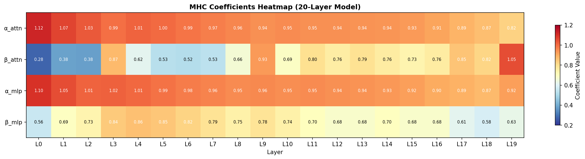

# Parameter Golf Solution

> Our exploration of the [Parameter Golf Challenge](https://github.com/openai/parameter-golf) — training a small language model in 10 minutes on 8×H100 to minimize BPB.

## 🏆 Progress: 2.28 → 1.40 BPB (-39%)

| Stage | Tokenizer | Technique | BPB | Improvement |
|-------|-----------|-----------|-----|-------------|
| Day 1 | Byte-level | Baseline | 2.28 | - |
| Day 1 | Byte-level | LeakyReLU² | 2.18 | -4.3% |
| Day 1 | Byte-level | + Sliding Window | 2.18 | -5.5% |
| Day 2 | **BPE-1024** | Same arch | 1.68 | **-23%** |
| Day 2 | **BPE-8192** | Same arch | 1.40 | **-35%** |
| Day 2 | BPE-8192 | + QAT (1.58-bit) | **1.40** | ≈0% loss, 9× smaller |

**Target**: < 1.13 BPB (leaderboard top: 1.11)

---

## 🔑 Key Discoveries

### 1. Tokenizer Matters More Than Architecture
```
10 hours of architecture tuning → 5% improvement
Better tokenizer → 35% improvement
```

### 2. QAT is Nearly Lossless
```
FP32 model: 1.402 BPB, ~120 MB
QAT model:  1.403 BPB, 13.5 MB  ← 9× smaller, 0.07% loss!
```

### 3. 8192 is the Sweet Spot for 16MB Limit
```
Vocab 8192 → Embedding uses 1.5 MB @ 1.58-bit
Vocab 32K  → Embedding uses 6 MB (too much!)
```

---

## 📊 Experiment Details

See [docs/experiment.md](docs/experiment.md) for the main experiment log.

### 🆕 mHC DeepSeek Residual Study
See [docs/mhc-depth-profiling.md](docs/mhc-depth-profiling.md) for our study on learnable layer-wise residual coefficients inspired by DeepSeek-V3.

**新发现**: 异常层规律 — 11L/20L/32L 模型均在 ~90% 深度出现 β 峰值



### Activation Functions
| Function | BPB | Winner |
|----------|-----|--------|
| GELU | 2.28 | |
| LeakyReLU² | 2.18 | ✅ |
| ReLU² | 2.20 | |

### Sliding Window Size
| Window | BPB | Winner |
|--------|-----|--------|
| Full | 2.28 | |
| 192 | 2.18 | ✅ |
| 128 | 2.19 | |

### Tokenizer Comparison
| Tokenizer | Vocab | BPB | Compression |
|-----------|-------|-----|-------------|
| Byte-level | 256 | 2.17 | 1.0× |
| BPE | 1024 | 1.68 | 2.3× |
| BPE | 8192 | 1.40 | 4.0× |

---

## 🏗️ Architecture

```
GPT with QAT
├── vocab_size: 8192 (BPE tokenizer)
├── dim: 512
├── layers: 9
├── heads: 8 (4 KV heads)
├── window_size: 192
├── activation: LeakyReLU²
├── quantization: Ternary (1.58-bit) via STE
└── total params: 30M (13.5MB quantized)
```

---

## 📁 Code Structure

```
parameter-golf-solution/
├── scripts/
│   └── modal/              # Modal 云端训练脚本
├── docs/
│   ├── experiment.md       # 主实验航海日志
│   ├── mhc-depth-profiling.md
│   ├── technique-analysis-cmp-pr1405.md
│   ├── todo.md
│   └── reference/          # 技术参考笔记
├── records/                # 单次实验记录、report、log、README
└── results/
    └── logs/               # 汇总 JSON / 提交结果
```

---

## 🚀 Running

### Local Test
```bash
python train_gpt.py --steps 100 --dataset tinyshakespeare
```

### Modal Cloud (H100)
```bash
# Baseline (mHC v2, 20层)
modal run --detach scripts/modal/modal_mhc_v2_deep.py

# Alternating Attention
modal run --detach scripts/modal/modal_alternating_attn.py

# Alternating Attention + mHC
modal run --detach scripts/modal/modal_alternating_attn.py -- --mhc
```

**Note**: Always use `--detach` to prevent task termination if CLI disconnects.

---

## 📈 Gap to Leaderboard

| | Us | Top 1 | Gap |
|--|-----|-------|-----|
| BPB | 1.40 | 1.11 | -20% |
| Techniques | Basic QAT | GPTQ + XSA + TTT | Advanced |

### Techniques We Haven't Tried Yet
- **XSA** (Cross-Sample Attention)
- **TTT** (Test-Time Training)
- **GPTQ** (advanced quantization)
- **Muon Optimizer**
- **BigramHash** (input augmentation)

---

## 💰 Cost

| Resource | Cost |
|----------|------|
| H100 × 10 min | ~$0.70 |
| Total experiments | ~$15 |

**Lesson learned**: Don't poll training logs! Cost $184 in 7 minutes due to session history bloat.

---

## 📚 References

- [Parameter Golf GitHub](https://github.com/openai/parameter-golf)
- [BitNet b1.58 Paper](https://arxiv.org/abs/2402.17764)
- [NanoGPT Speedrun](https://github.com/KellerJordan/modded-nanogpt)

---

*Last updated: 2026-04-18*
