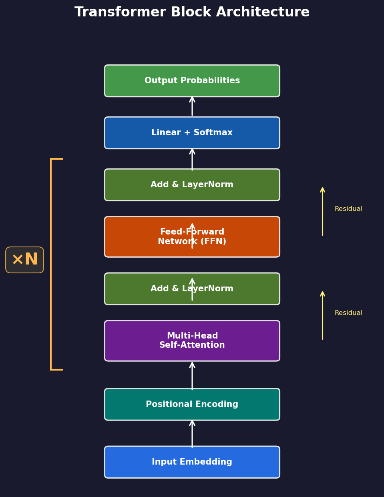

# Transformer Basics

> This is where it all begins. Understanding Transformers is the key to understanding why certain improvements work.

## One-Line Definition

**Transformer = Attention + FFN + Residual Connections**

It's a neural network architecture that excels at processing sequential data (text, code, audio, etc.).

---

## Architecture Overview



*Transformer Block: Input Embedding → Positional Encoding → Multi-Head Self-Attention (+ residual) → FFN (+ residual) → Output. The block repeats ×N layers.*

---

## Core Components

### 1. Self-Attention

**Purpose**: Allows each word to "look at" all other words in the sequence and decide what to focus on.

**Intuition**: When you read the word "it", you instinctively look back to find what "it" refers to. Attention lets the model automatically learn this "looking back" behavior.

```
Input: "The cat sat on the mat because it was tired"
                                      ↑
                                    What does "it" refer to?
                                      ↓
Attention learns: it → cat (high weight)
```

**Math** (simplified):

$$
\text{Attention}(Q, K, V) = \text{softmax}\left(\frac{QK^T}{\sqrt{d}}\right) V
$$

- **Q (Query)**: What am I looking for?
- **K (Key)**: What features do I have?
- **V (Value)**: What is my content?
- **softmax**: Converts scores into probabilities (sum = 1)
- **√d**: Scaling factor to prevent values from getting too large

**Self-Attention Weight Matrix:**


*Attention weights for a sample sentence. Brighter = stronger attention. Notice "it" attending back to "fox" (token co-reference).*

### 2. FFN (Feed-Forward Network)

**Purpose**: Independently applies a non-linear transformation at each position, increasing expressive power.

**Intuition**: Attention handles "information exchange"; FFN handles "information processing".

```python
# Simplest FFN
def ffn(x):
    hidden = relu(x @ W1)  # expand dimensions first
    output = hidden @ W2    # then compress back
    return output
```

### 3. Residual Connection + LayerNorm

**Residual Connection**: `output = layer(x) + x`

**Intuition**: Makes gradients flow more easily, stabilizing training. Like keeping the old road when building a new one — if the new road breaks, you still have the old route.

**LayerNorm**: Normalizes each sample's features to mean 0 and variance 1.

---

## Transformer Block

A complete Transformer Block:

```
Input x
    │
    ├── LayerNorm
    ├── Self-Attention
    ├── Residual connection (+x)
    │
    ├── LayerNorm
    ├── FFN
    ├── Residual connection (+x)
    │
    ▼
Output
```

Stacking multiple Blocks = deeper network = greater expressive power

---

## In Parameter Golf

Our `StandardGPT` is a standard Transformer decoder:

```python
model_config = {
    "dim": 512,        # feature dimension
    "n_layers": 9,     # stack 9 Blocks
    "n_heads": 8,      # 8 attention heads
    "vocab_size": 50257,
}
```

**Why use Transformer?**
- High parallel computation efficiency
- Strong modeling of long-range dependencies
- The current standard architecture for language models

---

## Positional Encoding: RoPE

Transformers have no inherent notion of position — they treat the sequence as a "bag of tokens". **Positional encoding** adds position information.

### RoPE (Rotary Position Embedding)

The modern approach used by LLaMA, GPT-NeoX, etc. Key idea: encode position by rotating the query/key vectors.

**Our Bug Fix**: The original implementation pre-allocated a fixed-size cos/sin table. When sequence length exceeded this, it crashed:

```
RuntimeError: index out of bounds
```

**Solution**: We wrote `RotaryEmbeddingDynamic` that auto-expands:

```python
class RotaryEmbeddingDynamic(nn.Module):
    def __init__(self, dim, max_seq_len=1024):
        super().__init__()
        self.dim = dim
        self.max_seq_len = max_seq_len
        self._build_cache(max_seq_len)
    
    def forward(self, x, seq_len):
        if seq_len > self.max_seq_len:
            # Auto-expand!
            self.max_seq_len = seq_len * 2
            self._build_cache(self.max_seq_len)
        return self._apply_rotary(x, seq_len)
```

This fixed the Sliding Window evaluation bug.

---

## Further Reading

1. [Attention Is All You Need](https://arxiv.org/abs/1706.03762) — the original paper
2. [The Illustrated Transformer](https://jalammar.github.io/illustrated-transformer/) — visual explanation
3. [LLM Fundamentals Day 4](https://github.com/Elarwei001/llm-fundamentals/blob/master/articles/en/day04-transformer-architecture.md) — our course

---

*Next: [Activation Functions](02-activation-functions.md)*
