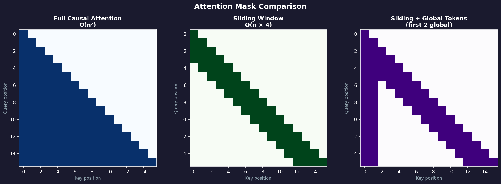
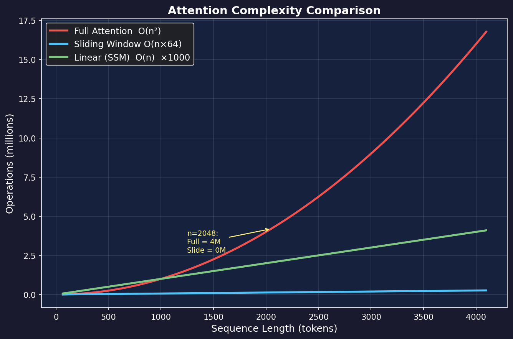

# Attention Variants

> Full Attention too expensive? Try these variants. Sliding Window works surprisingly well on short sequences.

## One-Line Definition

**Attention Variants = Different ways to restrict "who can see whom"**

Full Attention lets every token see all other tokens, with O(n²) complexity. Variants reduce cost by limiting the field of view.

---

## Attention Mask Comparison



*Left: Full Causal Attention (lower-triangular). Center: Sliding Window (each token sees only the last k tokens). Right: Sliding Window + Global tokens (first 2 tokens attend everywhere).*

---

## Full Attention (Standard)

```
Token:  1  2  3  4  5
    1   ✓  ✓  ✓  ✓  ✓
    2   ✓  ✓  ✓  ✓  ✓
    3   ✓  ✓  ✓  ✓  ✓
    4   ✓  ✓  ✓  ✓  ✓
    5   ✓  ✓  ✓  ✓  ✓

Every token can see all other tokens
```

**Problems**:
- Computation O(n²)
- Memory O(n²)
- Explodes with longer sequences

---

## Causal Attention (Used by GPT)

```
Token:  1  2  3  4  5
    1   ✓  ✗  ✗  ✗  ✗
    2   ✓  ✓  ✗  ✗  ✗
    3   ✓  ✓  ✓  ✗  ✗
    4   ✓  ✓  ✓  ✓  ✗
    5   ✓  ✓  ✓  ✓  ✓

Can only see itself and previous tokens (no peeking at the future)
```

**Why it's needed**: Language models are autoregressive — when predicting the next token, the answer can't be revealed in advance.

---

## Sliding Window Attention (What we use 🏆)

```
Window size = 3

Token:  1  2  3  4  5
    1   ✓  ✓  ✓  ✗  ✗
    2   ✓  ✓  ✓  ✓  ✗
    3   ✓  ✓  ✓  ✓  ✓
    4   ✗  ✓  ✓  ✓  ✓
    5   ✗  ✗  ✓  ✓  ✓

Each token only looks at the k nearest neighbors (local window)
```

**Advantages**:
- Computation O(n × k), where k is the window size
- Local information is usually most important
- Indirect global view achieved by stacking layers

**Our configuration**:
```python
window_size = 256  # each token looks at 256 nearest neighbors
```

---

## Complexity Comparison



*Full Attention scales quadratically with sequence length; Sliding Window is linear. At 2048 tokens, full attention requires ~4M ops vs only ~128K for sliding window (window=64).*

---

## Our Experimental Results

| Attention | BPB | vs Baseline |
|-----------|-----|-------------|
| Full (Causal) | 2.4939 | — |
| **Sliding Window** | **2.3568** | **-5.5%** 🏆 |

**Unexpected finding**: On short sequences (128 tokens), Sliding Window actually outperforms Full Attention!

**Possible reasons**:
1. Local attention provides useful inductive bias
2. Reduces noise (no need to attend to tokens far away)
3. Similar to CNN's local receptive field

---

## Other Variants (Not Tried)

| Variant | Idea | Use Case |
|---------|------|----------|
| **Sparse Attention** | Only attend to specific patterns (e.g., every other token) | Very long sequences |
| **Linear Attention** | Use kernel trick to reduce O(n²) to O(n) | Efficiency-first |
| **Flash Attention** | Same math, optimized GPU memory access | General speedup |
| **Multi-Query Attention** | Multiple Q heads share K/V | Inference speedup |

---

## Recommendation Guide

| Sequence Length | Recommendation |
|-----------------|----------------|
| Short (<512) | Sliding Window or Full |
| Medium (512–4K) | Full + Flash Attention |
| Long (>4K) | Sliding Window or Sparse |
| Very long (>100K) | Mamba/SSM (non-Attention) |

---

*Previous: [Activation Functions](02-activation-functions.md) | Next: [Optimizers](04-optimizers.md)*
