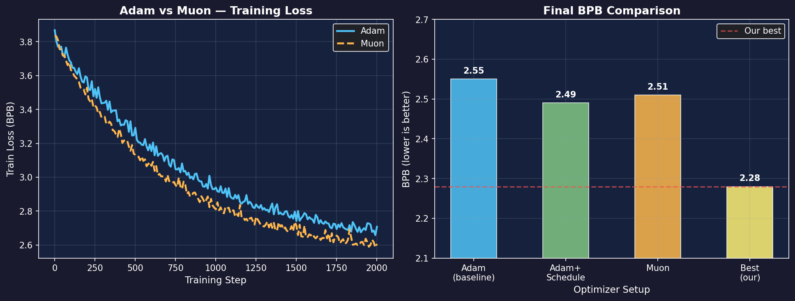
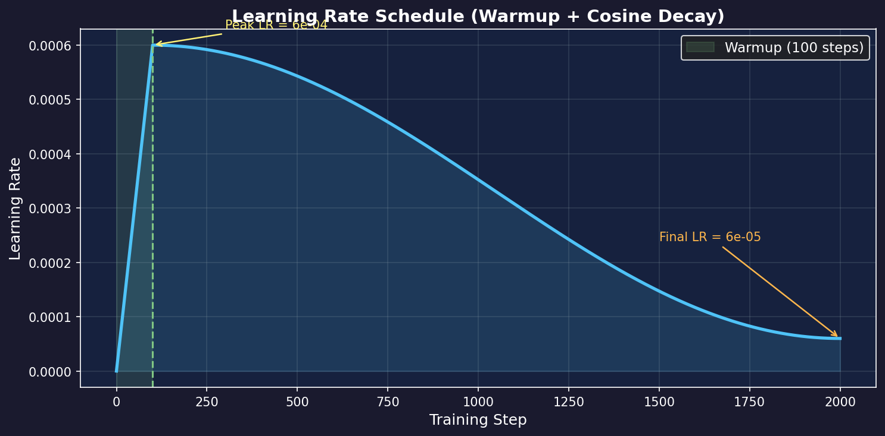

# Optimizers

> The "driver" of neural network training. Choose the right optimizer for faster convergence and better results.

## One-Line Definition

**Optimizer = Decides how to update weights based on gradients**

Gradients tell you "which direction to go"; the optimizer decides "how fast and how to get there".

---

## Gradient Descent Basics

The simplest update rule:

$$
w_{new} = w_{old} - \eta \cdot \nabla L
$$

- **w**: weights
- **η (eta)**: learning rate
- **∇L**: gradient of the loss function

**Problems**:
- Learning rate too large → oscillation
- Learning rate too small → too slow
- Using the same learning rate for all parameters is unreasonable

---

## Adam (Most Common)

**Core idea**: Maintain an individual learning rate for each parameter, adapting based on historical gradients.

$$
m_t = \beta_1 m_{t-1} + (1-\beta_1) g_t \quad \text{(momentum)}
$$
$$
v_t = \beta_2 v_{t-1} + (1-\beta_2) g_t^2 \quad \text{(second moment)}
$$
$$
w_t = w_{t-1} - \eta \cdot \frac{m_t}{\sqrt{v_t} + \epsilon}
$$

**Intuition**:
- **m (momentum)**: Smooths gradients to avoid oscillation
- **v (second moment)**: Estimates gradient "volatility" — parameters with high volatility get smaller learning rates
- **ε**: Prevents division by zero

---

## AdamW (Our Choice 🏆)

**Improvement**: Decouples weight decay from the Adam update formula.

```python
# Adam's weight decay (problematic)
gradient = gradient + weight_decay * weight

# AdamW's weight decay (correct)
weight = weight - learning_rate * weight_decay * weight
```

**Why it's better**:
- Cleaner regularization effect
- Decoupled from learning rate
- More stable training

---

## Muon (The New Kid)

**Paper claims**: Converges 2x faster than Adam.

### The Intuition: Why Newton's Method?

Imagine you're hiking down a mountain (minimizing loss) in dense fog:

| Method | Strategy | Problem |
|--------|----------|---------|
| **SGD** | Walk downhill based on slope under your feet | Might zigzag, slow |
| **Adam** | Walk downhill + remember recent directions | Better, but still local |
| **Newton** | Use curvature to predict where the bottom is | Directly aim for minimum! |

**Newton's method** uses second-order information (curvature/Hessian) to make smarter steps:

$$
w_{new} = w_{old} - H^{-1} \nabla L
$$

Where **H** is the Hessian matrix (second derivatives). The problem? Computing H⁻¹ is **O(n³)** — impossible for millions of parameters.

### Muon's Trick: Approximate the Hessian Cheaply

Muon approximates the Hessian inverse using **momentum orthogonalization**:

```python
# Simplified Muon idea
def muon_step(grad, prev_grad, prev_update):
    # Orthogonalize current gradient against previous update
    # This approximates Newton direction without computing Hessian
    
    # 1. Project out the component parallel to previous update
    proj = dot(grad, prev_update) / dot(prev_update, prev_update)
    grad_orth = grad - proj * prev_update
    
    # 2. Use this "cleaned" gradient
    return -lr * grad_orth
```

**Why it works**:
- Removes redundant gradient directions
- Implicitly captures curvature information
- Much cheaper than full Newton: **O(n)** instead of O(n³)

### Why "Muon"?

**Mu**-**O**rthogonalized **N**ewton — the name reflects the orthogonalization trick.

### The Trade-off

| Aspect | Adam | Muon |
|--------|------|------|
| **Per-step cost** | O(n) | O(n) — similar |
| **Memory** | 2× params (m, v) | 2× params (similar) |
| **Early training** | Slower | **Faster** ✓ |
| **Late training** | **More stable** ✓ | Can overshoot |
| **Hyperparameter sensitivity** | Robust | More sensitive |

### Our Experiment Deep Dive

**Our experiments (what actually happened)**:

| Time | AdamW | Muon |
|------|-------|------|
| 15min | 4.07 | **3.99** ✓ |
| 30min | **3.73** | 3.91 |
| 60min | **3.55** 🏆 | 3.85 |



*Left: Training loss curves for Adam vs Muon. Right: Final BPB comparison across optimizer setups.*

**Analysis**:
- **15 min**: Muon's Newton-approximation gives it a head start
- **30+ min**: AdamW's conservative updates avoid overshooting
- **Why the reversal?** Muon's aggressive steps may overshoot near the minimum

**Conclusion**:
- Muon is great for **short training runs** or **quick prototyping**
- AdamW is better for **long training** or **final models**
- **Don't blindly trust papers** — always validate on YOUR setup!

### When to Use Muon?

| Scenario | Recommendation |
|----------|----------------|
| Quick experiment (<30 min) | Try Muon |
| Final training run | Stick with AdamW |
| Hyperparameter search | Muon (faster iterations) |
| Production model | AdamW (more predictable) |

---

## Learning Rate Scheduling

Choosing an optimizer isn't enough — how the learning rate changes over time matters too.



*Warmup (100 steps, linear) then cosine decay to 10% of peak LR. Our config: peak LR = 6e-4, total 2000 steps.*

### Warmup

```
lr
│     ╱────────
│    ╱
│   ╱
│  ╱
│ ╱
└─────────────── step
   warmup
```

**Why**: Early in training, weights are random and gradients are unstable. A large learning rate can easily cause divergence. Start small, then increase.

### Cosine Decay

```
lr
│────╮
│    ╲
│     ╲
│      ╲
│       ╰────
└─────────────── step
```

**Why**: Later in training, a smaller learning rate helps with fine-grained adjustments.

---

## Our Configuration

```python
optimizer = torch.optim.AdamW(
    model.parameters(),
    lr=0.0006,
    betas=(0.9, 0.95),
    weight_decay=0.1,
)

# Cosine schedule with warmup
scheduler = get_cosine_schedule_with_warmup(
    optimizer,
    num_warmup_steps=100,
    num_training_steps=total_steps,
)
```

---

## Tuning Guide

| Parameter | Typical Range | Our Value |
|-----------|---------------|-----------|
| **lr** | 1e-4 ~ 1e-3 | 6e-4 |
| **weight_decay** | 0.01 ~ 0.1 | 0.1 |
| **warmup_steps** | 1% ~ 5% of total | 100 |
| **beta1** | 0.9 | 0.9 |
| **beta2** | 0.95 ~ 0.999 | 0.95 |

---

## Common Questions

### Q: Training not converging?

1. Learning rate too large → reduce lr
2. No warmup → add it
3. Exploding gradients → add gradient clipping

### Q: Converging too slowly?

1. Learning rate too small → increase lr
2. Batch size too small → increase it
3. Try a more aggressive optimizer (e.g., Muon)

### Q: Overfitting?

1. weight_decay too small → increase it
2. Add dropout
3. Reduce model size

---

*Previous: [Attention Variants](03-attention-variants.md) | Next: [Quantization](05-quantization.md)*
