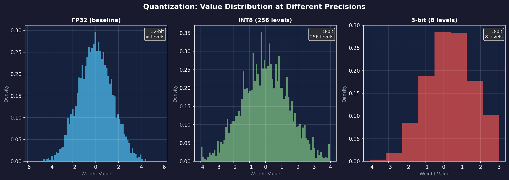
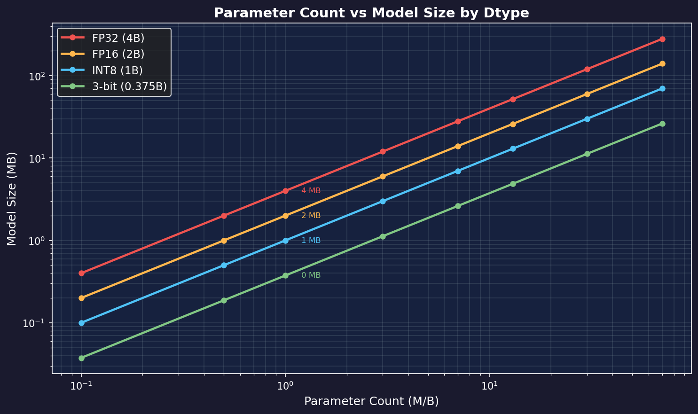

# Quantization

> Compress the model from 32-bit to 3-bit — 10x size reduction. A key technique in Parameter Golf.

## One-Line Definition

**Quantization = Represent weights using fewer bits**

FP32 → INT8 → INT4 → 3-bit: trade precision for size.

---

## Why Do We Need Quantization?

Parameter Golf rules:

> Model must be ≤ 16MB @ 3-bit quantization

Say you have 50M parameters:
- FP32: 50M × 4 bytes = **200 MB** ❌
- INT8: 50M × 1 byte = **50 MB** ❌
- 3-bit: 50M × 0.375 bytes = **18.75 MB** ❌
- 3-bit + 40M params: 40M × 0.375 = **15 MB** ✅

---

## Quantization Basics

### Linear Quantization

Map floating-point numbers to integers:

$$
x_q = \text{round}\left(\frac{x - z}{s}\right)
$$

- **s (scale)**: scaling factor
- **z (zero-point)**: zero-point offset
- **x_q**: quantized integer

**Dequantization**:

$$
x \approx s \cdot x_q + z
$$

### Example

```
Original values: [-0.5, 0.0, 0.5, 1.0, 1.5]
Quantize to INT8 (0-255):
  scale = (1.5 - (-0.5)) / 255 = 0.00784
  zero_point = 64

Quantized: [0, 64, 128, 192, 255]
```

---

## Common Quantization Types

| Type | Bits | Size Ratio | Precision Loss |
|------|------|------------|----------------|
| FP32 | 32 | 1.0x | None |
| FP16 | 16 | 0.5x | Very small |
| INT8 | 8 | 0.25x | Small |
| INT4 | 4 | 0.125x | Moderate |
| **3-bit** | 3 | 0.09x | **Needs tricks** |



*Weight value distribution at different precisions. FP32 is smooth and continuous; INT8 has 256 discrete levels; 3-bit has only 8 levels — information loss is clearly visible.*



*Model storage size vs parameter count for different dtypes (log scale). 3-bit quantization allows roughly 10× more parameters within the same size budget.*

---

## Post-Training Quantization (PTQ)

**Process**: Train first → then quantize

```python
# Simplified example
def quantize_weights(model, bits=8):
    for param in model.parameters():
        # Find min/max
        min_val, max_val = param.min(), param.max()
        # Compute scale
        scale = (max_val - min_val) / (2**bits - 1)
        # Quantize
        param_q = torch.round((param - min_val) / scale)
        # Store
        ...
```

**Problem**: 3-bit PTQ loses a lot of precision because quantization error isn't accounted for during training.

---

## Quantization-Aware Training (QAT) 🔥

**Process**: Simulate quantization effects during training

```python
# During forward pass
def forward(self, x):
    # Simulate quantization
    w_q = fake_quantize(self.weight, bits=3)
    return F.linear(x, w_q)

def fake_quantize(x, bits):
    scale = x.abs().max() / (2**(bits-1) - 1)
    x_q = torch.round(x / scale)
    x_q = torch.clamp(x_q, -2**(bits-1), 2**(bits-1)-1)
    # Straight-Through Estimator: quantize forward, pass gradient through unchanged
    return x_q * scale
```

**Advantages**:
- Model learns to adapt to quantization error
- Can maintain good precision even at 3-bit
- **Top leaderboard teams all use QAT**

---

## The Challenge of 3-bit Quantization

3 bits = 8 discrete values, e.g.: `-3, -2, -1, 0, 1, 2, 3, 4`

**Problems**:
1. Too few values to represent a continuous distribution
2. Outliers waste the quantization range
3. Different layers have different distributions, requiring different scales

**Solutions**:
- **Per-channel quantization**: Quantize each channel independently
- **Mixed precision**: Use more bits for critical layers
- **Outlier handling**: Handle outliers specially

---

## Our Current Status

⏳ **QAT not yet implemented**

Current workflow:
1. Train in FP32
2. Assume 3-bit quantization at evaluation
3. Quantize when actually submitting

**Next step**: Implement QAT — likely one of the highest-impact improvements available.

---

## Code Framework

```python
class QuantizedLinear(nn.Module):
    def __init__(self, in_features, out_features, bits=3):
        super().__init__()
        self.bits = bits
        self.weight = nn.Parameter(torch.randn(out_features, in_features))
        self.scale = nn.Parameter(torch.ones(out_features))
    
    def forward(self, x):
        if self.training:
            # QAT: simulate quantization
            w_q = self._fake_quantize(self.weight)
        else:
            # Inference: real quantization
            w_q = self._real_quantize(self.weight)
        return F.linear(x, w_q)
    
    def _fake_quantize(self, w):
        # Straight-Through Estimator
        ...
```

---

## Leaderboard Leader Technology Preview

The top team (1.1194 BPB) uses these quantization-related techniques:
- **QAT**: Account for quantization during training
- **Per-channel scale**: Independent scale per output channel
- **Learned step size**: Make scale learnable too

This is the direction **we most need to explore**.

---

*Previous: [Optimizers](04-optimizers.md) | Next: [Alternative Architectures](06-alternative-architectures.md)*
