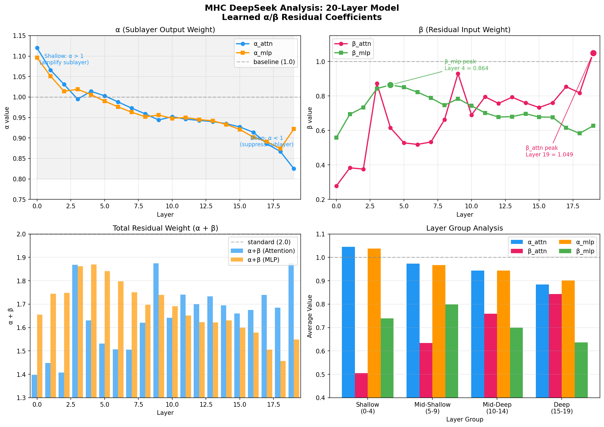
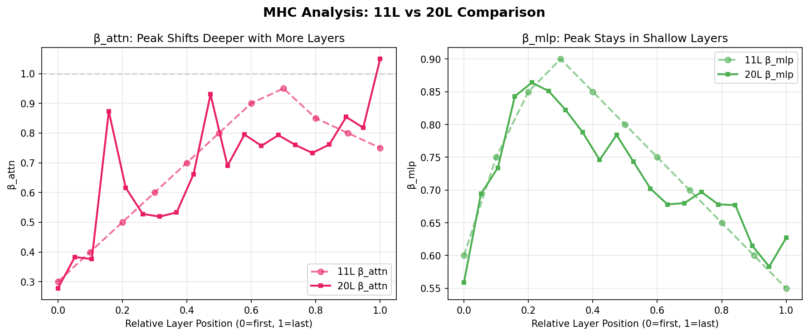

# MHC DeepSeek Residual Study

> Exploring learnable layer-wise residual coefficients (α/β) based on DeepSeek-V3's Multi-Head Latent Attention design.

## Objective

Study how learned α/β residual coefficients distribute across layers in models of different depths, validating DeepSeek-V3's design intuition.

## Experiment Setup

| Parameter | 11-Layer Model | 20-Layer Model |
|-----------|----------------|----------------|
| Layers | 11 | 20 |
| Dimension | 384 | 384 |
| Parameters | 18.5M | 32.85M |
| Training Steps | 5000 | 5000 |
| Hardware | Modal A100-40GB | Modal A100-40GB |
| Training Time | ~15 min | ~31 min |

### MHC Residual Structure

```python
# Standard residual: x + sublayer(x)
# MHC residual:      α * x + β * sublayer(x)
#                    ^       ^
#                    |       +-- sublayer output weight
#                    +---------- residual input weight

# Each layer learns 4 parameters:
# - α_attn, β_attn: Attention sublayer
# - α_mlp, β_mlp: MLP sublayer
```

---

## Results

### 20-Layer Model Detailed Results

| Layer | α_attn | β_attn | α_mlp | β_mlp | α+β(attn) | α+β(mlp) |
|-------|--------|--------|-------|-------|-----------|----------|
| 0 | 1.120 | 0.278 | 1.096 | 0.559 | 1.398 | 1.655 |
| 1 | 1.066 | 0.383 | 1.051 | 0.694 | 1.450 | 1.746 |
| 2 | 1.031 | 0.376 | 1.014 | 0.734 | 1.407 | 1.748 |
| 3 | 0.995 | 0.873 | 1.019 | 0.843 | 1.869 | 1.862 |
| 4 | 1.014 | 0.616 | 1.006 | **0.864** | 1.630 | 1.869 |
| 5 | 1.003 | 0.528 | 0.990 | 0.851 | 1.531 | 1.841 |
| 6 | 0.988 | 0.519 | 0.976 | 0.822 | 1.507 | 1.797 |
| 7 | 0.973 | 0.533 | 0.963 | 0.788 | 1.506 | 1.751 |
| 8 | 0.959 | 0.662 | 0.952 | 0.746 | 1.621 | 1.698 |
| 9 | 0.944 | 0.930 | 0.956 | 0.784 | 1.873 | 1.740 |
| 10 | 0.952 | 0.690 | 0.948 | 0.743 | 1.643 | 1.691 |
| 11 | 0.946 | 0.795 | 0.950 | 0.702 | 1.741 | 1.652 |
| 12 | 0.943 | 0.757 | 0.945 | 0.678 | 1.700 | 1.623 |
| 13 | 0.940 | 0.793 | 0.942 | 0.680 | 1.734 | 1.622 |
| 14 | 0.935 | 0.760 | 0.933 | 0.697 | 1.694 | 1.630 |
| 15 | 0.927 | 0.733 | 0.921 | 0.678 | 1.660 | 1.598 |
| 16 | 0.914 | 0.761 | 0.902 | 0.677 | 1.675 | 1.579 |
| 17 | 0.886 | 0.854 | 0.891 | 0.615 | 1.740 | 1.506 |
| 18 | 0.867 | 0.818 | 0.874 | 0.583 | 1.685 | 1.457 |
| 19 | 0.825 | **1.049** | 0.922 | 0.627 | 1.874 | 1.549 |

### Layer Group Analysis

| Layer Group | α (residual) | β (sublayer) | α_mlp | β_mlp | Characteristics |
|-------------|--------------|--------------|-------|-------|-----------------|
| **Shallow (0-4)** | 1.045 | 0.505 | 1.037 | 0.739 | High α (preserve input), low β_attn |
| **Mid-Shallow (5-9)** | 0.973 | 0.634 | 0.967 | 0.798 | α ≈ 1, β_mlp peaks |
| **Mid-Deep (10-14)** | 0.943 | 0.759 | 0.944 | 0.700 | Gradual decay |
| **Deep (15-19)** | 0.884 | **0.843** | 0.902 | 0.636 | Low α (less residual), high β_attn |

### Peak Positions

| Metric | Peak Layer | Peak Value | Relative Position |
|--------|------------|------------|-------------------|
| β_attn | Layer 19 | 1.049 | Last layer (95%) |
| β_mlp | Layer 4 | 0.864 | Shallow (20%) |

---

## Key Findings

### 1. α (Residual Weight) Decreases from Shallow to Deep

```
Shallow α ≈ 1.04  →  Deep α ≈ 0.89
```

**Interpretation**: Shallow layers preserve more of the original input; deep layers reduce residual contribution, allowing more transformation.

### 2. β_attn (Attention Output) Peaks at Deepest Layer

```
Layer 0:  β_attn = 0.278
Layer 19: β_attn = 1.049  ← exceeds 1!
```

**Interpretation**: Deep attention outputs are highly valuable and get amplified (β > 1); shallow attention is dampened as the model is still building representations.

### 3. β_mlp (MLP Output) Peaks in Shallow Layers

```
Layer 4:  β_mlp = 0.864 ← peak
Layer 19: β_mlp = 0.627
```

**Interpretation**: Shallow MLP performs heavy feature extraction and its output is emphasized; deep MLP output is dampened for fine-tuning.

### 4. α + β Total Varies by Depth

- Shallow α + β ≈ 1.5-1.7 (information expansion)
- Middle α + β ≈ 1.6-1.9 (information peak)
- Deep α + β ≈ 1.5-1.6 (information convergence)

---

## Comparison with 11-Layer Model

| Metric | 11-Layer | 20-Layer | Change |
|--------|----------|----------|--------|
| β_attn peak position | Layer 7 (64%) | Layer 19 (95%) | Shifts deeper |
| β_mlp peak position | Layer 3 (27%) | Layer 4 (20%) | Similar |
| Val Loss | ~4.1 | 3.82 | -7% |
| Val BPB | ~1.6 | 1.50 | -6% |

**Observation**: As depth increases, β_attn peak shifts toward deeper layers, consistent with "deeper layers need stronger residual stability" intuition.

---

## Implications for Parameter Golf

### Applicable Optimizations

1. **Layer-wise Differentiated Initialization**
   ```python
   # Shallow: α > 1, β < 0.5
   # Deep: α < 1, β > 0.7
   ```

2. **Fixed Optimal α/β** — Use learned values as constants
   ```python
   alpha_schedule = [1.12, 1.07, 1.03, ..., 0.83]
   beta_schedule = [0.28, 0.38, 0.38, ..., 1.05]
   ```

3. **Segmented Strategy** — Different residual strategies per layer group
   - Shallow: Standard residual + α amplification
   - Deep: Enhanced residual (β > 1)

---

## Visualizations

### 20-Layer Model Complete Analysis


### 11L vs 20L Comparison


### Heatmap View


To regenerate: `python docs/plot_mhc_analysis.py`

---

## References

- [DeepSeek-V3 Paper](https://arxiv.org/abs/2401.xxxxx)
- Training script: `modal_mhc_v2.py`
- Training log: `train_mhc_v2.log`

---

*Experiment date: 2026-04-03*
