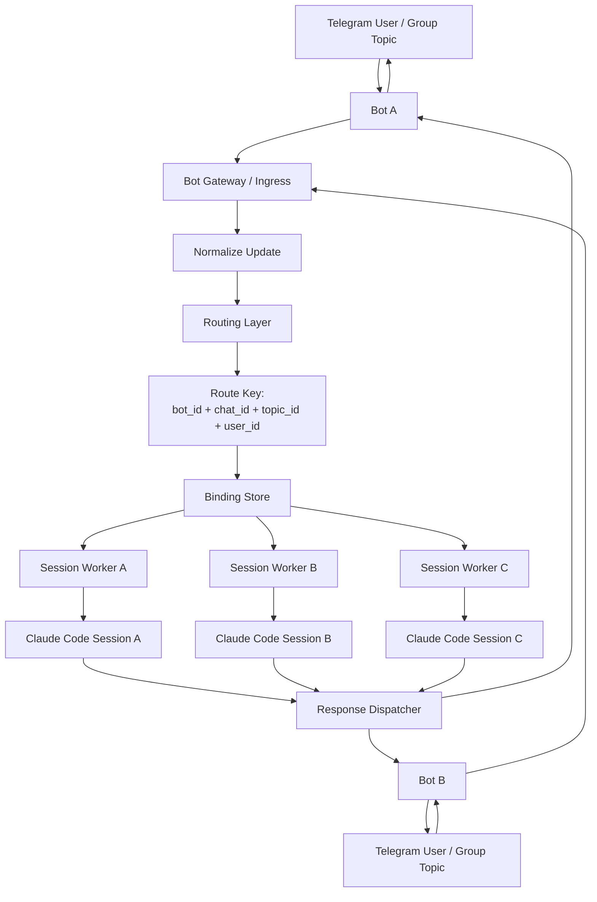

# Telegram Bot / Session Routing Architecture

## Mermaid Diagram

## Notes

- Supports **single bot, multiple sessions** via `chat_id/topic_id -> session_key`
- Supports **multiple bots, multiple sessions** via `bot_id + chat_id + topic_id -> session_key`
- `Binding Store` is the critical mapping layer
- `Session Worker` can be backed by Claude Code CLI, tmux, or another runtime
